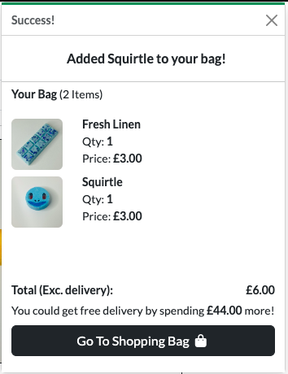
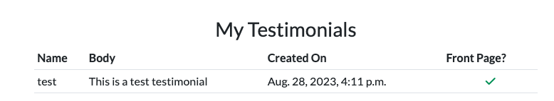
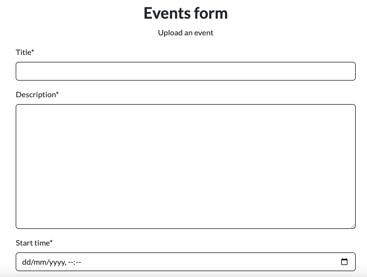

# FizzyBeese
FizzyBeese is a small independently run business that sells bath bombs, wax melts, and other various accessories directly to their customers. Users can browse products by category, price, or fragrance. Users are also able to add products to their cart and checkout securely. 

## Table of Contents
- [Site Aims](#site-aims)
- [Target Market](#target-market)
- [Marketing Plan](#marketing-plan)
- [Agile Development](#agile-development)
   - [Five Planes of UX/UI Design](#5-planes-of-ux-and-ui-design)
      - [Strategy](#strategy)
      - [Scope](#scope)
      - [Structure](#structure)
      - [Skeleton](#skeleton)
      - [Surface](#surface)
   - [Following Agile Methodologies](#following-agile-methodologies)
   - [Epics](#epics)
- [SEO considerations](#seo-considerations)
- [ER Diagram](#entity-relationship-diagram)
   - [Model Descriptions](#model-descriptions)
   - [Model Relationships](#model-relationships)
- [Features](#features)
   - [Existing Features](#existing-features)
   - [Future Features](#future-features)
- [Testing](#testing)
- [Bugs](#bugs)
- [Deployment](#deployment)
- [Credits](#credits)

## Site Aims
This site aims to act as a platform where users can browse the products available, make purchases, receive confirmation of their orders, contact the admin, and view any upcoming events that the business may be attending. 

The website aims to be user and admin-friendly and portray a relaxing feel that's in line with the products that the site offers. 

## Target Market
When designing the website for our bath bomb and wax melt business, I carefully considered the characteristics and preferences of our target market to create a compelling user experience.

**Primary Demographic:** The primary demographic consists predominantly of women, yet it also includes individuals who share a passion for self-care and indulgence. This broad range of customers spans various age groups, encompassing children, teenagers, young adults, and middle-aged individuals, allowing us to cater to a diverse customer base.

**Focus on Self-Care:** Our target market comprises individuals who prioritise self-care, seeking stress relief and tranquility in their daily lives. Whether it's unwinding in a soothing bath or basking in the calming aroma of wax melts, these customers crave relaxation and moments of serenity.

**Interest in Natural and Eco-Friendly Products:** Their interest in natural and eco-friendly products aligns with our commitment to providing sustainable and wellness-oriented offerings.

**Gift Shoppers:** An essential segment of our target market includes gift shoppers who view our bath bombs and wax melts as thoughtful presents for their loved ones. By recognising this opportunity, we aim to emphasise the gifting aspect of our products, making them a perfect choice for special occasions.

**Online Shoppers:** Given the e-commerce nature of our business, we specifically targeted online shoppers who prefer the convenience and ease of purchasing products from their digital devices. Thus, we focused on optimizing the website for seamless navigation and an effortless checkout process, ensuring a hassle-free shopping experience.

To effectively reach and appeal to our target market, we consider marketing strategies that showcase the products' soothing and relaxing properties, highlight the use of natural ingredients, and emphasize the unique scents and designs of bath bombs and wax melts. Social media marketing, email newsletters, and engaging website content can all be valuable tools to connect with the target audience and build brand loyalty.

## E-commerce application type
This website employs a B2C (business-to-consumer) business model, meaning that our primary focus is to sell directly to our customers. To achieve this, our website will prioritize user-friendliness and accessibility, making it effortless for consumers to find and purchase our products, including the ability to view immediate prices and add directly to the bag from the products list. 

## Marketing Plan

As FizzyBeese is a small independent business the budget for marketing is limited. However, there are several ways that FizzyBeese can market itself and increase the chances of converting more customers. 

**Social Media:** To foster brand engagement and communication, our website will feature links to our social media accounts. We will run targeted ads to reach out to a wide audience tailored to our target market. I have created a mock Facebook page which you can view [here](readme/fizzy-beese-facebook.png).

**Mailing list:** Another way to gain more brand awareness is by sending regular newsletters to the mailing list obtained via the MailChimp form. The newsletter would contain information about the products we sell, updates about new products, promotions, and other relevant updates.

**Google Ads:** The use of Google ads is a great way to increase brand awareness and help with SEO. The use of Google ads can also help with the use of long-tail keywords and help with the ranking of the site.

**Influencers:** Influencers are a great way to increase brand awareness. Free samples can be sent to influencers in exchange for mentions or affiliate links. Influencers tend to have a wide reach of people that follow them, therefore, increasing our brand awareness.

#### Some extra marketing considerations to keep users on our website may include:

**Homepage Design:** The homepage will be designed to be clear, attractive, and instantly engage users. We'll prominently feature a well-defined call-to-action button upon entering the page, ensuring users understand the purpose of our site right away. The home page will also feature other things useful to both users and the admin. The admin will have the ability to show off some featured products and also the latest products that have been uploaded. The home page will also feature the business's core values, testimonials, and the address and a map to show where the store is. I feel that this will build trust with the customer and ultimately enhance sales.

**User-Friendly Navigation:** User-friendly navigation is crucial for our B2C business model. By providing an intuitive and seamless browsing experience, we aim to encourage users to spend more time on the site, ultimately leading to increased sales. Additionally, our responsive design will ensure that customers can enjoy a consistent experience across all devices, enhancing accessibility.

**Smooth Checkout Process:** The shopping cart functionality will be easy to use, allowing users to add, update, and delete items effortlessly. We'll also provide instant feedback to users as they make changes to their cart, ensuring a smooth checkout process. The users will receive a confirmation email when making a purchase and will also be able to view their past orders on their profile page.

**Customer Communication:** In order to facilitate communication with our customers, we will provide accessible contact information for store admin. This will allow users to reach out with any queries or concerns they may have, promoting a positive customer experience.

By implementing these features and functionalities, our B2C website aims to create a seamless and enjoyable shopping experience, encouraging repeat visits and capitalizing on impulse purchases.

## Agile Development
### 5 Planes of UX and UI Design
#### Strategy:
The target market for this website is primarily women of most ages. They tend to be individuals who prioritise self-care and indulgence. These people also tend to be interested in natural and eco-friendly products. The marketing goals for this website are to increase brand awareness, generate leads, and drive sales. The marketing strategies that will be used to achieve these goals include social media marketing, email newsletters, and engaging website content. The main goal of the website is to attract users into purchasing the products on offer.

#### Scope:
The products that will be sold on this website are bath bombs, wax melts, other scented products, and various accessories for these products. The audience for this website is online shoppers who prefer the convenience and ease of purchasing products from their digital devices.

The features that will be included on this website are:
- Clear, attractive, and engaging homepage
- Call to action button on the homepage
- User-friendly navigation
- Smooth checkout process
- Accessible contact information for the store admin
- Links to social media accounts
- Option to sign up for a mailing list
- Responsive design for all devices

#### Structure:
The homepage of this website will feature a clear call-to-action button, product categories, and featured products. The individual product pages will provide detailed product information, including images, descriptions, and prices. The shopping cart will be easy to use and will provide instant feedback to users as they make changes to their cart. The checkout process will be smooth and will have clear instructions. The contact information for the store admin will be accessible and easy to find. The social media links and the mailing list sign-up will be displayed in the footer throughout the website. These pages will all be accessible via the header/nav bar displayed on all the pages. Users will be able to view their account or shopping bag from their respective icons at the top of the header, displayed on every page. The products will be displayed by category, for example, bath bombs, wax melts, etc. They will also have extra filtering such as alphabetically, by price, and by fragrance type. From the products pages, you will be able to click on an individual product that will take you to view more details about a product including some more pictures of the product, product description, and the option to add it to your shopping bag.

#### Skeleton:
The colours that will be used on this website will be soft, calming colours that invoke a sense of relaxation. The fonts used will be clean and simple fonts that are easy to read and scan. The images used on this website will be high-quality and showcase the products and their benefits. The layout of this website will be simple and uncluttered making it easy to navigate.

You can view my wireframes diagrams [here](WIREFRAMES.md)

#### Surface:
The text on this website will be clear and concise, making it easy to understand. The buttons on this website will be large and easy to click, they will be labeled clearly so users know exactly what to do. The forms on the website will be simple and easy to fill out, with clear instructions. The error messages on this website will be clear and helpful, helping users correct their mistakes.

### Following Agile Methodologies

The way that I followed agile principles was by creating a Kanban board containing all of my user stories. This kanban board can be found [here](https://github.com/users/stephenbeese/projects/6)

When starting the project I uploaded all of my user stories to the to-do section of my Kanban board.
These user stories were labeled by:
   - Must Have
   - Should Have
   - Could Have

labeling the user stories in this way allowed me to focus on which ones to prioritise when working through the project.

The way I justified these labels is as follows:
   - Must haves are absolutely crucial for an e-commerce site. For example, view cart, checkout, and payment.
   - Should have are highly desired but not crucial for the site to function as an e-commerce site. Such as filtering products and viewing order history
   - Could haves are nice to have but not at all crucial to an e-commerce application. Such as events and contact forms.

When I would get to a position where I was ready to start working on a new feature I would move the relevant user story into the in-progress section on the Kanban board and start working on it.
Once this feature was completed I would move the user story from the in-progress section to the done section allowing me to easily keep track of my progress.

### Epics
#### **Customer's Point of View:**

1. **User Registration and Authentication:**
   - Customers can create new accounts or log in with existing ones to view order history and manage their profile information.

2. **Browse Products and Categories:**
   - Customers can easily search and browse through a wide range of bath bombs, wax melts, and accessories, sorted by categories, prices, and other filters.

3. **Product Details:**
   - Customers can view detailed information about each product, including descriptions, images, and prices.

4. **Add to Cart:**
   - Customers can add desired products to their shopping cart to collect items for purchase.

5. **Manage Shopping Cart:**
   - Customers can view, edit, and remove items from their shopping cart before proceeding to checkout.

6. **Checkout and Payment:**
   - Customers can securely check out and complete purchases using various payment methods.

7. **Sale and Clearance:**
   - Customers can view sale and clearance items.

8. **Customer Support:**
   - Customers can access help, submit inquiries, and receive support regarding products, orders, or general assistance.

9. **Create and View Testimonials:**
   - Customers can create and view testimonials to be able to leave reviews about the products they have ordered and experiences they’ve had.

#### **Admin's Point of View:**
1. **Admin Dashboard:**
   - Admins can access a centralized dashboard to monitor and manage the entire e-commerce platform.

2. **Product Management:**
   - Admins can add, edit, and remove products, as well as manage product categories and inventory.

3. **Order Management:**
   - Admins can view and process incoming orders.

4. **User Management:**
   - Admins can manage user accounts and handle user inquiries.

5. **Promotions and Discounts:**
   - Admins can create sales and also add items to clearance.

6. **Customer Feedback and Reviews:**
   - Admins can monitor and moderate customer reviews and feedback to maintain product quality and customer satisfaction.

7. **Inventory Management:**
   - Admins can update stock levels.

8. **Content Management:**
   - Admins can manage website content, such as updating product descriptions, names, and images.

## SEO considerations
### Keywords
To increase SEO I have used a keywords and description Meta tag in the head of my [base.html](templates/base.html) template. I initially wrote down as many short and long-tail keywords I could think of. I then typed some keywords into wordtracker.com to see which keywords had the highest volume (average number of searches) with the lowest competition.

With finding this balance the list of best keywords are as follows:
- scented wax melts, best scented wax melts, high scented wax melts, homemade muscle soak bath bomb, homemade bath bombs, homemade bath bombs uk, bath bomb set, Homemade toilet bombs, Toilet bombs uk, Cruelty free mens fragrance uk, Best selling bath products, Coconut bath products, Eco-friendly bath products.

I have also included some other keywords that may be less efficient but are still relevant.

### Page Titles
Each page title contains an extra title after the business name to help assist with SEO

### Robots.txt and sitemap.xml
A [sitemap.xml](sitemap.xml) and a [robots.txt](robots.txt) file have been added to the site's root to help with the site's SEO.

## Entity Relationship Diagram

### Model Descriptions:
- **Products**
    - The purpose of this model is to represent individual products available for purchase. It contains essential information about each product, including its name, detailed description, price, weight, available stock quantity, associated categories, specific fragrance names, fragrance types, sale price (if applicable), clearance status, product images, and ingredients label.

 

- **ProductCategory**
    - The purpose of this model is to store various categories of products, such as "Bath Bomb," "Wax Melt," "Candle," etc. This categorisation enables users to easily find and filter products based on their preferences. A single product can belong to multiple categories, providing versatility and better search results. For instance, a wax melt gift set may be categorised under "Wax Melt," "Gift Set," and "Wax Burner," allowing customers to find it under any of these categories. 

 

- **FragranceName**
    - The purpose of this model is to store different names of available fragrances. It allows products to be associated with specific scents, enhancing the customer's understanding of the product. Some products may have multiple fragrance names attached to them if they come in various scents, like a gift set with multiple different products/scents.

 

- **FragranceType**
    - The purpose of this model is to store generic fragrance types, such as "Fresh," "Fruity," "Perfume," etc. These fragrance types provide additional filtering options for customers. Users can choose a preferred fragrance type, and the system will display products that match their desired fragrance category, simplifying the product search process.

 

- **Images**
    - The purpose of this model is to store additional images related to products for their detailed display. Each image is associated with a specific product ID, making it easily retrievable and allowing customers to view multiple product images on the product detail page.

 

- **Order**
    - The purpose of this model is to store comprehensive information about customer orders. It includes details related to the order, such as the order number, customer information, delivery address, order date, delivery class, delivery cost, order total, and grand total.

 

- **OrderLineItem**
    - The purpose of this model is to store individual line items within an order, representing specific products and their corresponding quantities. It facilitates the organisation of orders and allows easy access to product-specific details within an order.

 

- **User**
    - The purpose of this model is to handle user accounts and authentication using Django's built-in user authentication system. It stores essential user information, including the username, email address, and securely hashed password, ensuring secure user authentication. This model enables users to create accounts, log in securely, and access various features based on their authentication status within the platform.

 

- **UserProfile**
    - The purpose of this model is to store additional information about a user, such as their full name and delivery information. This information streamlines the checkout process for returning customers, as they can save their details for future purchases, providing a more convenient shopping experience. 

 

- **Testimonial**
    - The purpose of this model is to enable users to leave reviews and provide feedback about their experiences with the business and its products. It allows customers to share their opinions and recommendations, which can influence other potential customers and help maintain product quality and customer satisfaction.

 

- **Contact**
    - The purpose of this model is to enable users to contact the admin to find out more about the products they offer. Users could also enquire about booking the store for an in-person event such as charity events or fairs.

 

- **Events**
    - The purpose of this model is to allow the admin to upload an event to the database and display future events to the user on an events page.

### Model Relationships:

- **Product and ProductCategory:**
    - Relationship: Many-to-Many
    - Products can belong to multiple categories, and categories can have multiple associated products.

 

- **Product and FragranceName:**
    - Relationship: Many-to-Many
    - Description: Each product can have multiple fragrance names associated with it.

 

- **Product and FragranceType:**
   - Relationship: Many-to-Many
   - Description: Products can have multiple fragrance types, and fragrance types can be associated with multiple products.

 

- **Product and Images:**
   - Relationship: One-to-Many
   - Description: Each product can have multiple images associated with it.

 

- **UserProfile and User:**
   - Relationship: One-to-One
   - Description: Each user account has a corresponding user profile with additional information.

 

- **Testimonial and UserProfile:**
   - Relationship: One-to-Many
   - Description: Each user profile can have multiple testimonials associated with it.

 

- **Order and UserProfile:**
   - Relationship: Many-to-One
   - Description: Each order is linked to a specific user profile, representing the customer who placed the order.

 

- **OrderLineItem and Order:**
   - Relationship: Many-to-One
   - Description: Each order line item is associated with a specific order.

 

- **OrderLineItem and Product:**
   - Relationship: Many-to-One
   - Description: Each order line item corresponds to a specific product that was ordered.

## Features
### Existing Features
#### Common to All Pages

**Navbar**
   - The navigation bar is the core navigation for this site. The navbar has a different layout on both mobile and desktop to allow for seamless navigation regardless of the device.

   The navbar contains:
      - Business Name
      - Search Bar
      - Account Menu
      - Shopping Bag Icon
      - Product Category Links and Sorting
      - Offers (SALE, Clearance)
         - The offers tab and dropdown options do not show if there are no sale or clearance products. This is so that users are not disappointed when they navigate to the sale page to find there are no products populating it.
      - About, Events and Contact Links

**Desktop View**
 
**Mobile View**

**Footer**
   - The footer also holds some important information. Such as:
      - Social Media links
      - Contact page
      - Privacy policy
      - External links
      - Mailing list

**Notifications (Toasts)**
   - I have included the use of toasts in this project to give feedback to the user about the changes to the bag, any errors they may face, and any relevant information that is useful.

**Offers**
   - In the navbar, there is an offers dropdown menu. 
   - This menu displays when there are products that populate it. For example, if there are sale items, clearance items or both.
   - The dropdown will not show if there are no sale or clearance items.

#### Page content

#### Home Page

**Our Products section**
   - The Our Products section features images of examples of some of the types of products this business offers. This is essentially another nav bar that will likely grab the users' attention when scrolling the home page. Once clicked it will take you to the product page with the relevant filtering for the option chosen.

**Featured and latest products**
   - This section features the latest products that have been uploaded to the database as well as the products the admin deems to be worthy of being on the front page. The latest products section allows regular customers to view products they may not have seen before straight away.

**Store values**
   - This section features the values of the store, helping to build trust and align ourselves with the target market.

**Testimonials**
   - The testimonials section is a way for users to give honest feedback about the business to other users. This again helps build trust with our target market and will hopefully convert new customers to make purchases.

**Location**
   - The location section features a Google Maps API pinned with the location of the store. It also contains the opening hours of the shop allowing users of this site to make a decision of if they would like to view the products in person before purchasing. Users may also like to support local independent businesses so knowing the location etc. may sway them to make a purchase or visit the shop.

#### Products

**Add to bag**
   - The product cards feature an add-to-bag button. This allows a user to add a product to the bag without having to view the product detail page. This reduces the amount of clicks a user needs to make to be able to purchase the products on offer.

**Product cards**
   - Each product is contained within its own card and contains an image, its product category and fragrance category tags, price, and an add-to-bag button.

**No products page**
   - When a user goes on a page with no items related to it they will be greeted by the following message:

**Sorting**
   - The user can sort the products in a multitude of ways for example:

**Sale Price**
   - If the product includes a sale price the product will look like this:

   - This allows the user to view the price before and after the sale, hopefully enticing them to purchase due to its reduced cost

**Out of stock**
   - If a product has no stock remaining the add-to-bag will be disabled and contain the text "Out of Stock". This does not allow the user to add this product to the bag.

#### Product detail page

**Stock remaining**
   - Just under the price a user can view the stock remaining of the selected product. This page will not allow a user to add more than the remaining stock into the bag. 

**Quantity button**
   - The quantity button allows a user to seamlessly choose the amount of the item they would like to purchase. The quantity minus button gets disabled when the value reaches 1. The value of this can go above the stock remaining value however it will not let the user add that many to the bag.

**Add to bag button**
   - The add to bag button allows the user to add this product to the bag with the relevant quantity they choose. The add-to-bag button will be disabled if the product is out of stock. 

**Return to the products page**
   - The Keep Shopping button will take the user back to the All Products page. 

**Additional product images**
   - Some products include additional images to show off the product from different angles or in use.

**Product ingredients labels**
   - Some products feature an ingredients label so that users can view what's in them. This helps a user decide if a product is suitable for them. Some users may have sensitive skin and may react badly to a certain ingredient. This allows users to check before purchase and covers the business for any legal requirements when selling these types of products.

#### Shopping bag

**Product image**
   - The shopping bag features images of the product in the bag so the customer can easily see what products they are about to purchase

**Quantity**
   - The shopping bag also features a quantity input box where they can edit the amount they would like directly from the shopping bag. Users also have the option to remove products directly from the bag if they no longer want them

**Subtotal**
   - In the shopping bag a user can also view the subtotal of each product they have in there. The subtotal is the price of the item multiplied by the quantity in their basket.

- **Delivery costs**
   - The user can see how much the delivery is going to cost. The delivery cost is calculated based on the total weight of the order. This site also offers free delivery on orders over £50. On the shopping bag page, you can also see how much more you would need to spend to receive this offer. Hopefully enticing users to spend more money with the business

- **Grand total**
   - The user's grand total is reflected to them just above the checkout button. This is a combination of the total price of all items and the delivery costs. This tells the user exactly how much their order will come to if they decide to go through with the checkout process.

#### Checkout page

- **Save info**
   - If logged in the user will have an option to save their delivery information to their profile making it easier to complete the checkout process next time they order. 

   - If the user is not logged in they will be prompted to if they would like to save their profile information.

- **Payment**
   - The card element is injected by the Stripe API and uses a payment system that is PCI compliant.

- **Spinner**
   - This site features a spinner when an order is submitted. This provides feedback to the user about the checkout process, showing them that it is attempting to submit. Any errors will be shown to the user in the form of a toast.

#### Checkout success page

- **Order summary**
   - The checkout success page features a summary of the users' order including the user's delivery details, products ordered, total price, etc. This can also be viewed in their profile.

- **Product pictures**
   - The checkout success page features images of the products ordered so the user can easily see the products they have ordered.

- **Email confirmation**
   - A confirmation email will be sent to the user upon purchase. The email will include a basic summary of the order and a thank you from the business.

### Profile

- **Edit delivery / personal information**
   - On the profile page a user can edit and update their personal information ready for the next order they complete. This will also automatically update if a user changes the information in the checkout process with the save info box checked.

**Order History**
   - On the profile page a user is able to view their past orders. They can click on the order number to view the full details of a past order. A user will need to be logged in to access this page.

- **View testimonial submissions**
   - A user can also view their submitted testimonials and also receive a status of whether or not their review has made it to the front page.

#### Contact Us

- **Contact Form**
   - The Contact Us page features a contact form with the following fields:
      - Name
      - Email address
      - Subject
      - Message

   - A user can submit this form to get in contact with the admin and ask about any inquiries they may have, whether that is in regards to products or booking them for events.

#### Contact Success

- **Shows message**
   - The contact success page shows the user that their contact form has been submitted by showing them the information they have entered. The page also says that the admin will get back to them on their email address as soon as possible.

#### Events

- **View events**
   - Users are able to view the upcoming events the shop will be attending. This allows the users to make plans to visit these events and view these products in person.

   - If there are no events the page will display the following:

                        ADD EVENTS HERE!!!!! NOT ADMIN!!!!!!!!!!!

### Existing Admin Features

The admin has the ability to do the following things from the frontend:

- **Add a product**
   - The admin can easily add new products from the account icon in the navbar.

- **Edit a product**
   - The admin has the ability to edit products either from the products list pages or the product details page. This makes changing product details efficient and easy to do.

- **Delete a product**
   - The admin is able to delete a product instantly from both the product list pages (as shown above) and the product detail page.

- **Add additional images to selected products**
   - The admin is able to add additional images to products to showcase the product in use.
   - They are also able to easily delete images they no longer want to display which can be done via the product detail page.

- **View all orders**
   - In the account dropdown menu in the navbar the admin can keep an eye on new orders by viewing the all orders page. This features a table containing relevant information about an order including:
      - Order Number
      - Date Ordered
      - Name
      - Customer Details
      - Items Ordered
      - Item Total
      - Total Weight
      - Delivery Cost
      - Grand Total
   
   - This information is everything the admin would need to ship an order. 
   - They can also view the full details by clicking on the order number to bring up the checkout success page.

- **Hide and view hidden products**
   - The admin has the ability to hide products. For example,
      - If they are planning to release a product or a range of products on a certain day
      - They want to temporarily remove products from user viewing

- **View products by stock**
   - This page allows the admin to view products by stock starting with the lowest amount first. This is beneficial as the admin can easily see what products they are running low on and therefore they can easily see which ones they would have to make.

- **Add an event**
   - The admin can add an event directly from the frontend. The form has some restrictions. For example,
      - The start time cannot be before today's date
      - The end time cannot be before the start time
   If either of these conditions occur there will be a toast explaining to the user what the issue is and how to correct it.

From the admin panel, the admin has the ability to:

- **Approve testimonials**
   - The user can approve testimonials by going to the testimonial database, selecting the relevant testimonial, and clicking approve. This will then show the testimonial on the front page.

- **View messages**
   - The admin will have to use the admin panel to view the messages. They can do this by going to the contacts section. 
   - There is a boolean field that the admin can check off once they have replied to them allowing them to easily see whether they have replied yet or not. This is reflected in the string displayed when viewing the entries in the admin panel. In the form f'Message from {user}: {subject} - replied: {replied}'

These features would ideally be able to be accessed via the frontend however due to time constraints they were not able to be implemented in this way. However, the admin still has access to these features and can still act upon them.

### Future Features

Some future features I would like to include are:

#### User Features
- **Product ratings and reviews**
   - In the future, I would like to add the ability for users to rate and review individual products.
   - This would be beneficial as the users would be able to see what other people think of the products we have on offer which will help to build trust with new customers.

- **Choose delivery or collection**
   - I would like to add the option of a user being able to collect their order if they do not want to pay for delivery.
   - Having this option could entice users to come into the shop where they are able to meet our staff and have a look around our shop. This could potentially lead to more sales by building relationships with our customers.

- **Discount codes**
   - In the future, I would like to add the inclusion of discount codes and certain long-running offers. Such as:
      - % off codes
      - Four wax bars for £10
      - Free delivery codes
      - Exclusive offers on different types of products

- **Additional payment methods**
   - I would also like to add some alternative payment methods such as:
      - Apple Pay
      - Clearpay
      - Klarna
      - Paypal
   - Having alternate payment methods such as the ones mentioned above means that the store can cater to almost anyone who wants to make a purchase.
   - Buy now pay later methods such as Clearpay and Klarna may encourage larger orders as the payments tend to be broken down across a few weeks or even months.

- **Save card information**
   - I would like to add the option of a user saving their card details so the checkout process will be even more efficient for them.

- **View past events**
   - I would also like to include the past events that the store has attended.
   - This isn't necessary however it would be nice to include to show the types of events we have done which could potentially bring up more opportunities for the future.
   - Having past events such as charity work will also help to build brand trust and show that the business has strong values and is a valued member of the local community. 

#### Admin Features
- **Approve testimonials from the frontend**
   - In the future, I would like to include the ability for the admin to approve testimonials from the front end. Removing the need for the admin to access the admin panel leaving that solely for the developer's use.

- **View contact forms in the frontend**
   - I would like to add the ability for the admin to view the messages sent by users directly in the frontend. Again, negating any use of the admin panel leaving it solely for the developers.

- **Recieve emails from contact forms**
   - I would like to add email functionality to the user contact forms where on submission the admin will receive an email with the details from the submission.
   - This would allow them to be notified and promptly respond rather than checking for messages when they can.

- **Live chat/chatbot**
   - A live chat or chatbot would be beneficial to this site. Users will be able to ask questions and receive information on products quickly and efficiently. 
   - Having this feature would hopefully convert users into customers if they weren't sure about the products the shop offers.

- **Ability to add discount codes**
   - As mentioned above I would like to add the inclusion of discount codes.
   - Having codes is a good way to try and get users to order. By running limited-time offers users may order more than normal or entice them to buy products they haven't tried before.

- **Automate nav links from product categories**
   - I would like to be able to have the navigation menu, in particular the home essentials dropdown menu, connected to the product categories database.
   - When clicked they will only show the products that are related to the relevant product category.

- **Shipping status**
   - In the order database I would like to add a field where the admin can update the shipping status of the order.
   - Once the shipping status has been updated I would like a confirmation email to be sent to the user telling them that their order is on its way.
   - This would be a useful feature for both the admin and the user to receive feedback on the status of an order.

## Testing

I have included testing details post-development in a separate document called [TESTING.md](TESTING.md)

### Bugs

Below is a list of bugs that occurred during the development process, the causes of them, and how they were solved.

| Bug | Cause | Solution |
|---|---|---|
| <code>{{ MEDIA_URL }}</code> was not pathing correctly to the image source. Meaning that images were not displaying. This issue was happening in both my development environment and production environment. | The issue was that there was a missing line in my settings.py file. | Add the following line of code to the context_processors <code>'django.template.context_processors.media',</code> |
| The image and label widget on the edit product page was not showing despite following the example in the Boutique ado project. | The template was rendering the form element as a crispy form, not the custom widget. | The issue here was solved by adding an if statement into the form (lines 24 to 27 in [edit_product.html](products/templates/products/edit_product.html)) to render the custom widget instead of the crispy form field. |
Failed Build when deploying to Heroku. | Heroku failed to build due to <code>backport.zoneinfo</code> | This requirement is only needed when the Python version is below 3.9 so I added the following code to only install the package when it is required. <code>backports.zoneinfo==0.2.1;python_version<"3.9"</code> |
| I was originally using the latest version of Django (v4.2.4). Which was fine until I needed to deploy. When attempting to connect to my ElephantSQL I was unable to use the version of PostgreSQL that they have to use for free which is 11.8. | The cause of this was that the Django version I was using was only compatible with PostgreSQL version 12 and up. | The solution to this was to uninstall Django using the terminal command <code>pip3 uninstall django</code> and then install Django version 3.2 with the following command <code>pip3 install Django==3.2</code>

## Deployment

To deploy this project I used Heroku as a hosting platform with ElephantSQL as the database and I used Amazon AWS (S3 bucket) to host my static and media files.

You can view the deployment process [here](DEPLOYMENT.md)

## Credits 

This project was inspired by the Boutique Ado walkthrough project. 

In particular:
- The bag app logic
- Quantity button logic
- Mobile top header
- Product sorting functionality
- Toasts
- Stripe
- Profile app
- Deployment

To complete this project I did follow along with the walkthrough lessons provided which helped me be able to complete the features in a logical order. 
I have not directly copied and pasted these sections and they have been altered to fit this project's needs. However, the core concepts are similar to the Boutique Ado walkthrough project.

## Media
- All images are original and were taken by me during this project.
- All products are real products for a family member's business.

