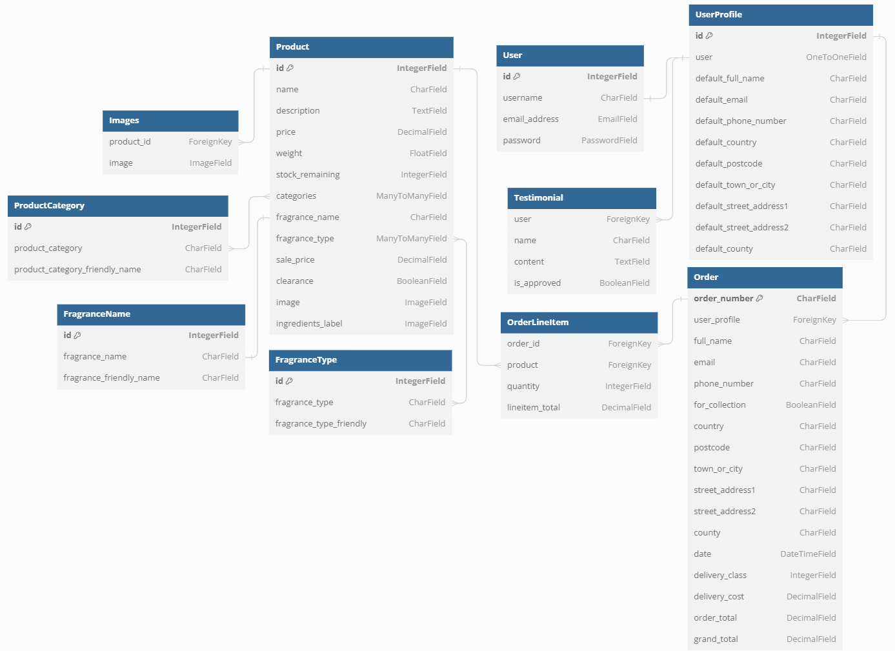

# FizzyBeese
FizzyBeese is an small independently run business that sells bath bombs, wax melts and other various accessories directly to their customers. Users can browse products by category, price or fragrance. Users are also able to add products to their cart and checkout securely. 

## [INSERT IMAGE HERE]

## Table of Contents
- [Features](#features)
   - [Existing Features](#existing-features)
   - [Future Features](#future-features)
- [Target Market](#target-market)
- [Marketing Plan](#marketing-plan)
- [Agile Development](#agile-development)
   - [Five Planes of UX/UI Design](#5-planes-of-ux-and-ui-design)
      - [Strategy](#strategy)
      - [Scope](#scope)
      - [Structure](#structure)
      - [Skeleton](#skeleton)
      - [Surface](#surface)
   - [Epics](#epics)
- [Testing](#testing)
   - [Manual Testing](#manual-testing)
   - [Automated Testing](#automated-testing)
   - [Validator Testing](#validator-testing)
   - [Bugs](#bugs)
- [Deployment](#deployment)
- [Wireframes](#wireframes)
- [Credits](#credits)

## Features
### Existing Features

### Future Features

## Target Market
When designing the website for our bath bomb and wax melt business, we carefully considered the characteristics and preferences of our target market to create a compelling user experience.

**Primary Demographic:** The primary demographic consists predominantly of women, yet it also includes individuals who share a passion for self-care and indulgence. This broad range of customers spans various age groups, encompassing children, teenagers, young adults, and middle-aged individuals, allowing us to cater to a diverse customer base.

**Focus on Self-Care:** Our target market comprises individuals who prioritize self-care, seeking stress relief and tranquility in their daily lives. Whether it's unwinding in a soothing bath or basking in the calming aroma of wax melts, these customers crave relaxation and moments of serenity.

**Interest in Natural and Eco-Friendly Products:** Their interest in natural and eco-friendly products aligns with our commitment to providing sustainable and wellness-oriented offerings.

**Gift Shoppers:** An essential segment of our target market includes gift shoppers who view our bath bombs and wax melts as thoughtful presents for their loved ones. By recognizing this opportunity, we aim to emphasize the gifting aspect of our products, making them a perfect choice for special occasions.

**Online Shoppers:** Given the e-commerce nature of our business, we specifically targeted online shoppers who prefer the convenience and ease of purchasing products from their digital devices. Thus, we focused on optimizing the website for seamless navigation and an effortless checkout process, ensuring a hassle-free shopping experience.

To effectively reach and appeal to our target market, we consider marketing strategies that showcase the products' soothing and relaxing properties, highlight the use of natural ingredients, and emphasize the unique scents and designs of the bath bombs and wax melts. Social media marketing, email newsletters, and engaging website content can all be valuable tools to connect with the target audience and build brand loyalty.

## Marketing Plan
This website employs a B2C (business-to-consumer) business model, meaning that our primary focus is to sell directly to our customers. To achieve this, our website will prioritize user-friendliness and accessibility, making it effortless for consumers to find and purchase our products, including the ability to view immediate prices.

**Homepage Design:** The homepage will be designed to be clear, attractive, and instantly engage users. We'll prominently feature a well-defined call-to-action button upon entering the page, ensuring users understand the purpose of our site right away.

**User-Friendly Navigation:** User-friendly navigation is crucial for our B2C business model. By providing an intuitive and seamless browsing experience, we aim to encourage users to spend more time on the site, ultimately leading to increased sales. Additionally, our responsive design will ensure that customers can enjoy a consistent experience across all devices, enhancing accessibility.

**Smooth Checkout Process:** The shopping cart functionality will be easy to use, allowing users to add and delete items effortlessly. We'll also provide instant feedback to users as they make changes to their cart, ensuring a smooth checkout process.

**Customer Communication:** In order to facilitate communication with our customers, we will provide accessible contact information for store admin. This will allow users to reach out with any queries or concerns they may have, promoting a positive customer experience.

**Brand Engagement:** To foster brand engagement and communication, our website will feature links to our social media accounts. Additionally, we'll offer the option for users to sign up for our mailing list/newsletter, allowing us to keep them informed about new products, promotions, and other relevant updates.

By implementing these features and functionalities, our B2C website aims to create a seamless and enjoyable shopping experience, encouraging repeat visits and capitalizing on impulse purchases.

## Agile Development
### 5 Planes of UX and UI Design
#### Strategy:
The target market for this website is primarily women of most ages. They tend to be individuals who prioritise self-care and indulgence. These people also tend to be interested in natural and eco-friendly products. The marketing goals for this website are to increase brand awareness, generate leads, and drive sales. The marketing strategies that will be used to achieve these goals include social media marketing, email newsletters, and engaging website content. The main goal of the website is to attract users into purchasing the products on offer.

#### Scope:
The products that will be sold on this website are bath bombs, wax melts, other scented products and various accessories for these products. The audience for this website is online shoppers who prefer the convenience and ease of purchasing products from their digital devices.

The features that will be included on this website are:
- Clear, attractive, and engaging homepage
- Call to action button on the homepage
- User-friendly navigation
- Smooth checkout process
- Accessible contact information for the store admin
- Links to social media accounts
- Option to sign up for a mailing list
- Responsive design for all devices

#### Structure:
The homepage of this website will feature a clear call-to-action button, product categories and featured products. The individual product pages will provide detailed product information, including images, descriptions, and prices. The shopping cart will be easy to use and will provide instant feedback to users as they make changes to their cart. The checkout process will be smooth and will have clear instructions. The contact information for the store admin will be accessible and easy to find. The social media links and the mailing list sign-up will be displayed in the footer throughout the website. These pages will all be accessible via the header/nav bar displayed on all the pages. Users will be able to view their account or shopping bag from their respective icons at the top of the header, displayed on every page. The products will be displayed by category, for example, bath bombs, wax melts, etc. They will also have extra filtering such as alphabetically, by price and by fragrance type. From the products pages, you will be able to click on an individual product that will take you to view more details about a product including some more pictures of the product, product description and the option to add it to your shopping bag.

You can view my wireframes diagrams [here](WIREFRAMES.md)

#### Skeleton:
The colours that will be used on this website will be soft, calming colours that invoke a sense of relaxation. The fonts used will be clean and simple fonts that are easy to read and scan. The images used on this website will be high-quality and showcase the products and their benefits. The layout of this website will be simple and uncluttered making it easy to navigate.

#### Surface:
The text on this website will be clear and concise, making it easy to understand. The buttons on this website will be large and easy to click, they will be labelled clearly so users know exactly what to do. The forms on the website will be simple and easy to fill out, with clear instructions. The error messages on this website will be clear and helpful, helping users correct their mistakes.

### Epics
#### **Customer's Point of View:**

1. **User Registration and Authentication:**
   - Customers can create new accounts or log in with existing ones to view order history and manage their profile information.

2. **Browse Products and Categories:**
   - Customers can easily search and browse through a wide range of bath bombs, wax melts, and accessories, sorted by categories, prices, and other filters.

3. **Product Details:**
   - Customers can view detailed information about each product, including descriptions, images, and prices.

4. **Add to Cart:**
   - Customers can add desired products to their shopping cart to collect items for purchase.

5. **Manage Shopping Cart:**
   - Customers can view, edit, and remove items from their shopping cart before proceeding to checkout.

6. **Checkout and Payment:**
   - Customers can securely check out and complete purchases using various payment methods.

7. **Sale and Clearance:**
   - Customers can view sale and clearance items.

8. **Customer Support:**
   - Customers can access help, submit inquiries, and receive support regarding products, orders, or general assistance.

9. **Create and View Testimonials:**
   - Customers can create and view testimonials to be able to leave reviews about the products they have ordered and experiences they’ve had.

#### **Admin's Point of View:**
1. **Admin Dashboard:**
   - Admins can access a centralized dashboard to monitor and manage the entire e-commerce platform.

2. **Product Management:**
   - Admins can add, edit, and remove products, as well as manage product categories and inventory.

3. **Order Management:**
   - Admins can view and process incoming orders.

4. **User Management:**
   - Admins can manage user accounts and handle user inquiries.

5. **Promotions and Discounts:**
   - Admins can create sales and also add items to clearance.

6. **Customer Feedback and Reviews:**
   - Admins can monitor and moderate customer reviews and feedback to maintain product quality and customer satisfaction.

7. **Inventory Management:**
   - Admins can update stock levels.

8. **Content Management:**
   - Admins can manage website content, such as updating product descriptions, names, and images.

## Entity Relationship Diagram

### Model Descriptions:
- **Products**
    - The purpose of this model is to represent individual products available for purchase. It contains essential information about each product, including its name, detailed description, price, weight, available stock quantity, associated categories, specific fragrance names, fragrance types, sale price (if applicable), clearance status, product images, and ingredients label.

 

- **ProductCategory**
    - The purpose of this model is to store various categories of products, such as "Bath Bomb," "Wax Melt," "Candle," etc. This categorisation enables users to easily find and filter products based on their preferences. A single product can belong to multiple categories, providing versatility and better search results. For instance, a wax melt gift set may be categorised under "Wax Melt," "Gift Set," and "Wax Burner," allowing customers to find it under any of these categories. 

 

- **FragranceName**
    - The purpose of this model is to store different names of available fragrances. It allows products to be associated with specific scents, enhancing the customer's understanding of the product. Some products may have multiple fragrance names attached to them if they come in various scents, like a gift set with multiple different products/scents.

 

- **FragranceType**
    - The purpose of this model is to store generic fragrance types, such as "Fresh," "Fruity," "Perfume," etc. These fragrance types provide additional filtering options for customers. Users can choose a preferred fragrance type, and the system will display products that match their desired fragrance category, simplifying the product search process.

 

- **Images**
    - The purpose of this model is to store additional images related to products for their detailed display. Each image is associated with a specific product ID, making it easily retrievable and allowing customers to view multiple product images on the product detail page.

 

- **Order**
    - The purpose of this model is to store comprehensive information about customer orders. It includes details related to the order, such as the order number, customer information, delivery address, order date, delivery class, delivery cost, order total, and grand total.

 

- **OrderLineItem**
    - The purpose of this model is to store individual line items within an order, representing specific products and their corresponding quantities. It facilitates the organisation of orders and allows easy access to product-specific details within an order.

 

- **User**
    - The purpose of this model is to handle user accounts and authentication using Django's built-in user authentication system. It stores essential user information, including the username, email address, and securely hashed password, ensuring secure user authentication. This model enables users to create accounts, log in securely, and access various features based on their authentication status within the platform.

 

- **UserProfile**
    - The purpose of this model is to store additional information about a user, such as their full name and delivery information. This information streamlines the checkout process for returning customers, as they can save their details for future purchases, providing a more convenient shopping experience. 

 

- **Testimonial**
    - The purpose of this model is to enable users to leave reviews and provide feedback about their experiences with the business and its products. It allows customers to share their opinions and recommendations, which can influence other potential customers and help maintain product quality and customer satisfaction.

### Model Relationships:

- **Product and ProductCategory:**
    - Relationship: Many-to-Many
    - Products can belong to multiple categories, and categories can have multiple associated products.

 

- **Product and FragranceName:**
    - Relationship: Many-to-Many
    - Description: Each product can have multiple fragrance names associated with it.

 

- **Product and FragranceType:**
   - Relationship: Many-to-Many
   - Description: Products can have multiple fragrance types, and fragrance types can be associated with multiple products.

 

- **Product and Images:**
   - Relationship: One-to-Many
   - Description: Each product can have multiple images associated with it.

 

- **UserProfile and User:**
   - Relationship: One-to-One
   - Description: Each user account has a corresponding user profile with additional information.

 

- **Testimonial and UserProfile:**
   - Relationship: One-to-Many
   - Description: Each user profile can have multiple testimonials associated with it.

 

- **Order and UserProfile:**
   - Relationship: Many-to-One
   - Description: Each order is linked to a specific user profile, representing the customer who placed the order.

 

- **OrderLineItem and Order:**
   - Relationship: Many-to-One
   - Description: Each order line item is associated with a specific order.

 

- **OrderLineItem and Product:**
   - Relationship: Many-to-One
   - Description: Each order line item corresponds to a specific product that was ordered.

## Testing
### Manual Testing
### Automated Testing
### Validator Testing
### Bugs

## Deployment

## Wireframes

You can view my wireframes for this project [here](WIREFRAMES.md)

## Credits 

This project was heavily inspired by the Boutique Ado walkthrough project. 

In particular:
- The bag app logic
- Quantity button logic
- Mobile top header
- Product sorting functionality

To complete this project I did follow along with the walkthrough lessons provided which helped me be able complete the features in a logical order. 
I have not directly copied and pasted these sections and the have been altered to fit this projects needs. However the core concepts are similar to the Boutique Ado walkthrough project.

