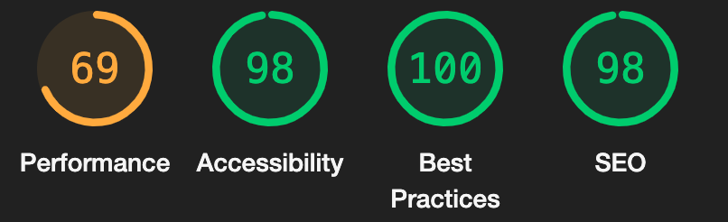
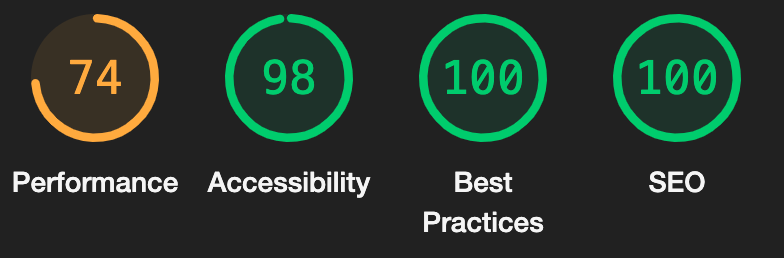

# Contents

- [Validator Testing](#validator-testing)
    - [HTML](#html)
    - [CSS](#css)
    - [Javascript](#javascript)
    - [Python](#python)
- [WAVE Evaluation Tool](#wave-evaluation-tool)
- [Lighthouse Reports](#lighthouse)
- [Manual Testing](#manual-testing-of-epics-and-user-stories)
    - [Epics](#epics)
    - [User Stories](#user-stories)
    - [Error Tetsing](#error-testing)
- [Automated Testing](#automated-testing)

# Validator testing

## HTML
To test the HTML of the site I used the W3C HTML Validator.

After testing each page by direct input, I can confirm that there were no errors other than an empty h1 element that contained the loading spinner for checkout submissions.

After filtering out this warning there were no further warnings or errors.

## CSS
I ran each CSS file through the W3C CSS validation service and I received no errors.

The files I tested were:
- static/css/base.css
- checkout/static/checkout/css/checkout.css
- checkout/static/checkout/css/checkout_success.css
- profiles/static/profiles/css/profiles.css

I did receive one warning on the checkout.css file and that was:

## Javascript
To test my javascript I ran each file and  element through JSHint and received no errors except for the following that were out of my control.

- stripe_elements.js - One undefined variable Stripe

- Google Maps API Javascript in index.html

- MailChimp embed in base.html

## Python
To check my Python files against pep8 I used pycodestyle to run a command that returns all the errors.

The only errors remaining after correcting them with autopep8 are as follows:

- **Bag app**
    - bag/views.py:1:80: E501 line too long (87 > 79 characters)

- **Checkout app**
    - checkout/models.py:125:80: E501 line too long (80 > 79 characters)

- **Contact app**
    - contact/models.py:20:80: E501 line too long (84 > 79 characters)

- **Events app**
    - events/migrations/0001_initial.py:29:80: E501 line too long (87 > 79 characters)

- **Fizzy Beese app**
    - fizzy_beese/settings.py:96:80: E501 line too long (84 > 79 characters)
    - fizzy_beese/settings.py:155:80: E501 line too long (91 > 79 characters)
    - fizzy_beese/settings.py:158:80: E501 line too long (81 > 79 characters)
    - fizzy_beese/settings.py:161:80: E501 line too long (82 > 79 characters)
    - fizzy_beese/settings.py:164:80: E501 line too long (83 > 79 characters)

- **Products app**
    - products/admin.py:2:80: E501 line too long (81 > 79 characters)
    - products/forms.py:3:80: E501 line too long (81 > 79 characters)
    - products/forms.py:12:80: E501 line too long (102 > 79 characters)
    - products/forms.py:13:80: E501 line too long (106 > 79 characters)
    - products/models.py:62:80: E501 line too long (88 > 79 characters)
    - products/views.py:6:80: E501 line too long (81 > 79 characters)
    - products/views.py:205:80: E501 line too long (83 > 79 characters)
    - products/widgets.py:9:80: E501 line too long (87 > 79 characters)
    - products/migrations/0001_initial.py:18:80: E501 line too long (117 > 79 characters)
    - products/migrations/0001_initial.py:20:80: E501 line too long (91 > 79 characters)
    - products/migrations/0001_initial.py:29:80: E501 line too long (117 > 79 characters)
    - products/migrations/0001_initial.py:31:80: E501 line too long (91 > 79 characters)
    - products/migrations/0001_initial.py:40:80: E501 line too long (117 > 79 characters)
    - products/migrations/0001_initial.py:46:80: E501 line too long (107 > 79 characters)
    - products/migrations/0001_initial.py:53:80: E501 line too long (98 > 79 characters)
    - products/migrations/0001_initial.py:54:80: E501 line too long (94 > 79 characters)
    - products/migrations/0001_initial.py:60:80: E501 line too long (117 > 79 characters)
    - products/migrations/0001_initial.py:62:80: E501 line too long (118 > 79 characters)
    - products/migrations/0005_alter_product_fragrance_categories.py:15:80: E501 line too long (86 > 79 characters)

- **Profiles app**
    profiles/forms.py:29:80: E501 line too long (88 > 79 characters)

As you can see above the only errors remaining are lines that are too long for the standard pep8 guidelines.

I did try to shorten these lines however some were not possible so I left them.

# WAVE Evaluation Tool

To test the accessibility of my website I used the [Wave Evaluation Tool](https://wave.webaim.org)

The WAVE evaluation tool generally came back with no errors.

The ones I did have though are as follows:

**Footer**
- Low contrast on MailChimp elements
- Missing aria label on MailChimp input field

**Products**
- Redundant links - This was due to having the product image and product name both wrapped in anchor tags.

**Checkout**
- Missing labels on form fields
- Again, I received a redundant links alert due to the reason mentioned above.

**Checkout Success**
- Empty table header - This is in regard to the order information table. The second column has been left blank to hold the values of the order information.

**Events**
- Empty table header - This is again due to styling choices. I do not feel that it is necessary to have a heading here.

**Add Product**
- No form label for image and image label fields.

 

# Lighthouse

### Home page

- Desktop

- Mobile

### All Products page

- Desktop

- Mobile

### Product Detail page

- Desktop

- Mobile

### Shopping Bag page

- Desktop

- Mobile

### Checkout page

- Desktop

- Mobile

### Checkout Success page

- Desktop

- Mobile

### Profile page

- Desktop

- Mobile

### Contact Form page

- Desktop

- Mobile

### Events page

- Desktop

- Mobile

### Events Form page

- Desktop

- Mobile

### Testimonial Form page

- Desktop

- Mobile

### About page

- Desktop

- Mobile

# Manual Testing of Epics and User Stories

## Epics

### Users Point of View:

### EPIC 1 - User Registration and Authentication

| Passed | Customers can create new accounts or log in with existing ones to view order history, and manage their profile information. | Notes |
|---|---|---|
| ✔ | Users can register and create a new account |
| ✔ | Users are sent a verification email when setting up an account |
| ✔ | Users can log in using the account information |
| ✔ | Users can log out of their account  |
| ✔ | Users are able to view their profile information on their profile page |
| ✔ | Users can view their past orders on their profile page |
| ✔ | Users can update their information on their profile page |
| ✔ | Users receive a clear error message when attempting to register with an email that's already in use. | If a user attempts to register with an email address that is already in use that will be explained to them via a confirmation email.
| ✔ |  Users receive a clear error message when attempting to log in with incorrect credentials. |
| ✔ |  Users receive a password reset email when they request a password reset. |
| ✔ |  Users are asked to confirm their password during registration to prevent typos. |
| ✔ |  Users are redirected to the home page after a successful login. |

### EPIC 2 - Browse Products and Categories

| Passed | Customers can easily search and browse through a wide range of bath bombs, wax melts, and accessories, sorted by categories, prices, and other filters. |
|---|---|
| ✔ | Customers can see a list of all products.
| ✔ | Customers can filter products by category name ascending and descending.
| ✔ | Customers can sort products by price ascending and descending.
| ✔ | Customers can filter products by other criteria, such as name, fragrance, or newest ascending and descending.
| ✔ | Customers can search for products by keyword.
| ✔ | Customers can view the details of a product, including a description, images, and price.
| ✔ | The website handles scenarios where no products match the applied filters. 

### EPIC 3 - Product Details

| Passed | Customers can view detailed information about each product, including descriptions, images, and prices. |
|---|---|
| ✔ | Customers can see a detailed description of each product.
| ✔ | Customers can see the images of each product.
| ✔ | Customers can see the price of each product.
| ✔ | Customers can see the remaining stock of each product.
| ✔ | The product details page correctly displays the selected product's information, even when accessed from different parts of the website.

### EPIC 4 - Add to Cart

| Passed | Customers can add desired products to their shopping cart to collect items for purchase. |
|---|---|
| ✔ | Customers can add products to their shopping cart
| ✔ | Customers can see the products in their shopping cart at any time.
| ✔ | Customers can't add more than the remaining stock to their bag.
| ✔ | Customers get instant feedback regarding adding a product to their bag.
| ✔ | The "Add to Bag" button becomes disabled for out-of-stock products.
| ✔ | The shopping cart updates instantly after adding/removing products.

### EPIC 5 - Manage Shopping Cart

| Passed | Customers can view, edit, and remove items from their shopping cart before proceeding to checkout. |
|---|---|
| ✔ | Customers can view the contents of their shopping cart.
| ✔ | Customers can edit the quantity of products in their shopping cart.
| ✔ | Customers can remove products from their shopping cart.
| ✔ | Customers can proceed to checkout once they are ready to purchase their items.
| ✔ | Customers are unable to add more than the remaining stock in their bag.
| ✔ | Customers can view their item total.
| ✔ | Customers can view their delivery costs.
| ✔ | Customers can view the grand total of their order.
| ✔ | Customers can view the amount they need to spend to get free delivery.
| ✔ | Customers can return to the products page.
| ✔ | The shopping cart retains its contents when the user navigates to different pages and comes back.

### EPIC 6 - Checkout and Payment

| Passed | Customers can securely check out and complete purchases |
|---|---|
| ✔ | Customers can enter their shipping and billing information.
| ✔ | Customers can select a payment method, such as credit card, debit card, or PayPal.
| ✔ | Customers can review their order before placing it.
| ✔ | Customers can submit their order and complete their purchase.
| ✔ | A confirmation page is displayed after the order is successfully submitted.
| ✔ | The customer receives a confirmation email with their order details.

### EPIC 7 - Sale and Clearance

| Passed | Customers can view sale and clearance items. |
|---|---|
| ✔ | Customers can see a list of all sale and clearance items.
| ✔ | Customers can filter sale and clearance items by category.
| ✔ | Customers can filter sale and clearance items by price.
| ✔ | Customers can view the details of a sale or clearance item, including a description, images, and price.
| ✔ | Sale prices are displayed prominently and clearly indicate the original price for comparison.

### EPIC 8 - Customer Support

| Passed | Customers can access help, submit inquiries, and receive support regarding products, orders, or general assistance. |
|---|---|
| ✔ | Customers can fill out a contact form to send a message to the store.
| ✔ | Customers are directed to contact the success page

### EPIC 9 - Create and View Testimonials

| Passed | Customers can create and view testimonials to be able to leave reviews about the products they have ordered and experiences they’ve had. |
|---|---|
| ✔ | Customers can create a testimonial by providing their name, email address, and a review of the product or service.
| ✔ | Customers can view testimonials from other customers.
| ✔ | Testimonials are moderated before being published.
| ✔ | Customers cannot submit testimonials without completing all required fields.

### Admin's Point of View:

### EPIC 1 - Admin Dashboard:

| Passed | Admins can access a dashboard for centralised monitoring and management of the e-commerce platform. |
|---|---|
| ✔ | Admins can securely log in to the admin panel using their credentials. |
| ✔ | Dashboard data updates in real-time, eliminating the need for manual refreshes. |
| ✔ | Navigation between different dashboard sections is intuitive and smooth. |

### EPIC 2 - Product Management:

| Passed | Admins can efficiently manage products and categories, including addition, editing, removal, and inventory control. |
|---|---|
| ✔ | Admins can add new products with complete details like name, description, price, images, and category. |
| ✔ | Product details can be edited, including updating images and descriptions. |
| ✔ | Admins can update the available quantity. |
| ✔ | Admins have the capability to remove products |
| ✔ | Product categories can be created, edited, and deleted as necessary. |
| ✔ | Admins can add additional images related to a product |
| ✔ | Admins can view hidden products |
| ✔ | Admins can easily unhide hidden products |
| ✔ | Admins can easily view products by stock remaining |

### EPIC 3 - Order Management:

| Passed | Admins can effectively manage incoming orders. |
|---|---|
| ✔ | Admins can access a list of all orders with comprehensive details like customer information and order status. |
| ✔ | Admins can access order history and track modifications made to orders over time.

### EPIC 4 - User Management:

| Passed | Admins can proficiently handle user accounts and inquiries, ensuring smooth interactions and support. |
|---|---|
| ✔ | Admins can search and locate users based on criteria like email, name, or order history. |
| ✔ | User profiles, encompassing contact information and order history, can be viewed by admins via the admin panel |
| ✔ | Admins can manage user inquiries |
| ✔ | Sensitive user information is handled securely and remains accessible only to authorised admins.

### EPIC 5 - Promotions and Discounts:

| Passed | Admins can seamlessly create and manage promotional offers and discounts for improved customer engagement. |
|---|---|
| ✔ | Admins can add a sale price to a product. |
| ✔ | Sale items can be viewed with original and discounted prices displayed. |
| ✔ | Items can be marked as clearance |
| ✔ | Offers navigation menu does not display when there are no sale or clearance items |
| ✔ | Offers navigation menu does display when their sale or clearance items exist |

### EPIC 6 - Customer Feedback and Reviews:

| Passed | Admins can effectively manage customer reviews and feedback to maintain product quality and customer satisfaction. |
|---|---|
| ✔ | Admins can access and review customer-submitted testimonials |
| ✔ | Admins can approve testimonials to show on the front page. |

### EPIC 7 - Inventory Management:

| Passed | Admins can efficiently manage inventory levels to ensure product availability and prevent stockouts. |
|---|---|
| ✔ | Admins can view all products filtered by stock low to high |
| ✔ | Admins can manually adjust stock levels when necessary |
| ✔ | Stock levels are reflected across the platform.|

### EPIC 8 - Content Management:

| Passed | Admins can easily manage website content, ensuring accurate and up-to-date information for users. |
|---|---|
| ✔ | Admins can update product descriptions, names, images, and other content. |
| ✔ | Content changes are consistently reflected throughout the website. |

## User Stories

### USER STORY 1 - User Registration

| Passed | Customers can create an account to securely log in and out. |
|---|---|
| ✔ | Customers are able to create an account using valid information. |
| ✔ | The account creation process requires a secure password. |
| ✔ | Verified users can successfully log in and out of their accounts.

### USER STORY 2 - Email Verification

| Passed | Customers can verify their email to confirm registration. |
|---|---|
| ✔ | After registration, customers receive an email verification link. |
| ✔ | Clicking the verification link confirms the registration process.

### USER STORY 3 - User Login

| Passed | Customers can log into their accounts using registered credentials. |
|---|---|
| ✔ | Registered customers can successfully log in using their email and password. |
| ✔ | Appropriate error messages are displayed for invalid login attempts.

### USER STORY 4 - View Profile Information

| Passed | Customers can view their profile information, including shipping address and contact details. |
|---|---|
| ✔ | Logged-in customers can access their profile information. |
| ✔ | Profile information accurately displays the shipping address and contact details.

### USER STORY 5 - Edit Profile Information

| Passed | Customers can edit their profile information to update changes. |
|---|---|
| ✔ | Logged-in customers have the ability to modify their profile details. |
| ✔ | Changes made to profile information are correctly saved.

### USER STORY 6 - Browse All Products

| Passed | Customers can access a complete list of available products. |
|---|---|
| ✔ | Customers are able to navigate to a page displaying all products. |
| ✔ | The list of products is accurately displayed.

### USER STORY 7 - Browse Product Categories

| Passed | Customers can see a list of product categories on the home page. |
|---|---|
| ✔ | Customers can easily locate a section displaying product categories. |
| ✔ | Product categories are reachable via the navbar 

### USER STORY 8 - Browse Specific Products

| Passed | Customers can click on a category to view products within that category. |
|---|---|
| ✔ | Customers have the ability to click on a specific category. |
| ✔ | Clicking on a category accurately displays products from that category.

### USER STORY 9 - Search Products

| Passed | Customers can enter keywords in the search bar to find specific products. |
|---|---|
| ✔ | Customers can interact with a search bar and enter keywords. |
| ✔ | Relevant search results are displayed based on the entered keywords.

### USER STORY 10 - Filter Products By Price

| Passed | Customers can apply filters to view products within specific price ranges. |
|---|---|
| ✔ | Customers can filter products by price ascending and descending. |

### USER STORY 11 - Filter Products By Name

| Passed | Customers can filter products by name for easier search. |
|---|---|
| ✔ | Customers can input a product name to apply the filter. |
| ✔ | Filtered results show products with names matching the input.

### USER STORY 12 - View Product Details

| Passed | Customers can click on a product to access detailed information. |
|---|---|
| ✔ | Customers can interact with product listings and access product detail pages. |
| ✔ | Detailed information includes descriptions, images, and prices.

### USER STORY 13 - Add Product to Cart

| Passed | Customers can add products to their cart for purchase. |
|---|---|
| ✔ | Customers can click on an "Add to Cart" button associated with each product. |
| ✔ | Successfully added products are accurately reflected in the cart.

### USER STORY 14 - View Cart

| Passed | Customers can view the contents of their shopping cart. |
|---|---|
| ✔ | Customers can click on a shopping bag icon to access their cart. |
| ✔ | Cart displays a list of products added by the customer.

### USER STORY 15 - Edit Cart Item Quantity

| Passed | Customers can adjust item quantities within the cart. |
|---|---|
| ✔ | Customers can interact with quantity input fields to modify amounts. |
| ✔ | Cart accurately updates based on quantity adjustments.

### USER STORY 16 - Remove Cart Items

| Passed | Customers can remove items from their shopping cart. |
|---|---|
| ✔ | Customers can click on a "Remove" button associated with each item in the cart. |
| ✔ | Removed items are promptly removed from the cart view.

### USER STORY 17 - Proceed to Checkout

| Passed | Customers can initiate the checkout process from the cart. |
|---|---|
| ✔ | Customers can click on a "Proceed to Checkout" button from the cart view. |
| ✔ | The checkout process starts as expected after clicking the button.

### USER STORY 19 - Card Payments

| Passed | Customers can securely enter card details for payment. |
|---|---|
| ✔ | Customers can input their card information in the required fields. |
| ✔ | Payment process successfully completes when card details are submitted.

### USER STORY 20 - View Sale and Clearance Items

| Passed | Customers can access sale and clearance sections to view discounted products. |
|---|---|
| ✔ | Customers can click on the "Sale" or "Clearance" sections to access discounted items. |
| ✔ | Sale and clearance sections accurately display products with reduced prices.

### USER STORY 21 - View Contact Us Details

| Passed | Customers can access contact details for customer support. |
|---|---|
| ✔ | Customers can click on a "Contact Us" link to access customer support information. |
| ✔ | Contact details are clearly displayed for easy access.

### USER STORY 22 - Contact Admin/Owner

| Passed | Customers can submit inquiries to the admin or owner through a contact form. |
|---|---|
| ✔ | Customers can fill out a form with their inquiry details. |
| ✔ | Submitted inquiries are successfully sent to the admin or owner.

### USER STORY 23 - Leave a Testimonial

| Passed | Customers can write and submit testimonials to review their experiences. |
|---|---|
| ✔ | Customers can provide their name, email, and testimonial in a submission form. |
| ✔ | Submitted testimonials are recorded for review and display.

### USER STORY 24 - View Order History

| Passed | Customers can access their order history to view past purchases. |
|---|---|
| ✔ | Logged-in customers can access their order history section via the profile page. |
| ✔ | Order history accurately displays the details of a user's order history. |
| ✔ | Users cannot view their order history if they are not logged in |

### USER STORY 25 - View Product Ingredient Labels

| Passed | Customers can view product ingredient labels for product suitability. |
|---|---|
| ✔ | Customers can view ingredient labels for products if they exist. |
| ✔ | Ingredient labels provide accurate information about product contents.

### Admin's Point of View:

### USER STORY 26 - Admin Login

| Passed | Admins can securely log into the admin dashboard. |
|---|---|
| ✔ | Admins can enter their credentials to access the admin dashboard. |
| ✔ | Secure login process prevents unauthorized access.

### USER STORY 27 - View Product Inventory

| Passed | Admins can view current product inventory levels. |
|---|---|
| ✔ | Admins can view a specific product's stock levels. |
| ✔ | Admins can view products displayed from least to most stock |

### USER STORY 28 - Add New Product

| Passed | Admins can add new products with accurate details. |
|---|---|
| ✔ | Admins can input product information such as name, description, and price. |
| ✔ | New products are submitted to the database with the correct details.

### USER STORY 29 - Add New Product Images

| Passed | Admins can upload images for new product listings. |
|---|---|
| ✔ | Admins can associate additional images with new product listings. |
| ✔ | Uploaded images accurately represent the associated products. |
| ✔ | Admins can change the existing images to new ones. |

### USER STORY 30 - Edit Product Details

| Passed | Admins can edit product information to keep details accurate. |
|---|---|
| ✔ | Admins can modify existing product details such as name, description, and price. |
| ✔ | Edited details are correctly saved for the respective products.

### USER STORY 31 - Delete Products

| Passed | Admins can remove products from the system as needed. |
|---|---|
| ✔ | Admins have the ability to delete products from the platform. |
| ✔ | Deleted products are no longer accessible or displayed.

### USER STORY 32 - View Orders

| Passed | Admins can access and view incoming orders for processing. |
|---|---|
| ✔ | Admins can navigate to a section displaying all customer orders. |
| ✔ | Orders are accurately listed along with relevant information.

### USER STORY 34 - Manage User Orders

| Passed | Admins can access user information to assist with inquiries or issues. |
|---|---|
| ✔ | Admins can access user orders and associated information. |
| ✔ | Order details are accurately displayed for admin assistance.

### USER STORY 35 - Handle Customer Inquiries

| Passed | Admins can respond to customer inquiries through the contact form. |
|---|---|
| ✔ | Admins can access inquiries submitted by customers via the admin. |

### USER STORY 36 - Create Sale

| Passed | Admins can create sales for specific products. |
|---|---|
| ✔ | Admins have the capability to set sale prices for selected products. |
| ✔ | Sale prices are applied accurately to the designated products. |
| ✔ | Products with sale prices can be viewed on the sale page |

### USER STORY 37 - Add Items to Clearance

| Passed | Admins can move products to the clearance section. |
|---|---|A
| ✔ | Admins can designate products to be part of the clearance section. |
| ✔ | Products moved to clearance will show on the clearance page

### USER STORY 38 - Manage Testimonials

| Passed | Admins can review and approve customer testimonials. |
|---|---|
| ✔ | Admins can access submitted customer testimonials for review via the admin panel. |
| ✔ | Testimonials approved by admins are displayed on the home page.

### USER STORY 39 - Update Product Content

| Passed | Admins can efficiently manage website content for accuracy. |
|---|---|
| ✔ | Admins can update product descriptions, names, images, and other content. |
| ✔ | Content changes are consistently reflected throughout the website.

### USER STORY 40 - Add and Update Ingredient Labels

| Passed | Admins can upload and update ingredient labels for products. |
|---|---|
| ✔ | Admins can associate ingredient labels with specific products. |
| ✔ | Ingredient labels accurately reflect the product's contents.

## Error Testing

| Passed | Criteria |
|---|---|
| ✔ | Custom 404 error page displays when a page has not been found |
| ✔ | Custom 500 error page displays when there is a server error |

## Automated Testing
There is no automated testing for this as it was out of scope for this project. 

If I were to work on this again in the future I would implement tests that ensure the website functions as it should. I would particularly focus and the bag and checkout portions of the app as that is the main purpose of this website. Extensive testing of this area will ensure that the payment process will be guaranteed to work as expected under any unforseen circumstance.